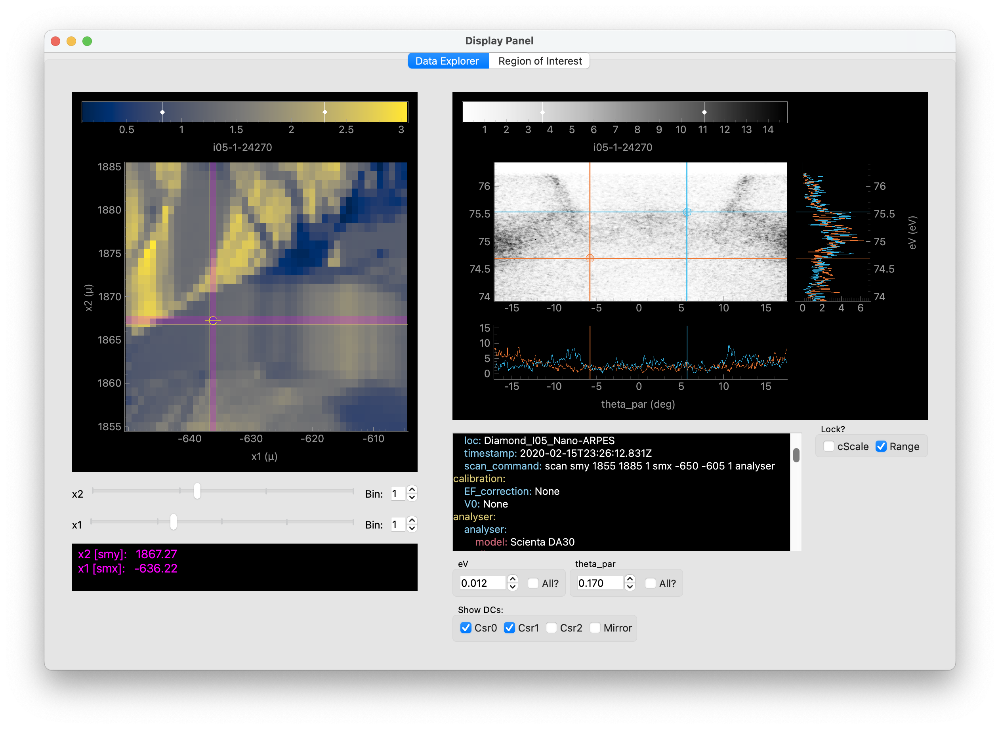

# Summary
The electronic band structure, describing the motion and interactions of electrons in materials, dictates the electrical, optical, and thermodynamic properties of solids. Angle-resolved photoemission spectroscopy (ARPES) provides a direct experimental probe of such electronic band structures, and so is widely employed in the study of functional, quantum, and 2D materials [@Damascelli2003; @king_angle_2021; @sobota_angle-resolved_2021]. `peaks` (**P**ython **E**lectron spectroscopy **A**nalysis by **K**ing group @ **S**t Andrews) provides a Python package for advanced data analysis of ARPES and related spectroscopic data. It facilitates the fast visualisation and analysis of multi-dimensional datasets, allows for the complex data hierarchy typical to ARPES experiments, and supports lazy data loading and parallel processing, reflecting the ever-increasing data volumes used in ARPES. It is designed to be run in an interactive notebook environment, with extensive inline and pop-out GUI support for data visualisation.   

# Statement of need
 Over recent years, significant technological improvements have developed ARPES into a truly multidimensional spectroscopy. Besides the traditional resolution of energy and up to three momentum directions, temperature, spin, spatial, and temporal-dependent ARPES measurements are becoming increasingly common [@king_angle_2021; @sobota_angle-resolved_2021], typically requiring efficient handling and advanced analysis of 3-, 4-, and higher-dimensional datasets. Extensive use of international light sources for performing ARPES measurements, during intensive experiment campaigns running over several days, further motivates a collaborative approach to performing data analysis. There is also an ever-increasing push to incorporate machine learning (ML) methods into the analysis pipeline [@melton_k-means-driven_2020; @kim_deep_2021; @iwasawa_unsupervised_2022; @agustsson_autoencoder_2025], while greater transparency and reproducibility in ARPES data analysis can be ensured by the development and utilisation of open-source packages, with clear and transparent metadata handling [@scheffler_fair_2022]. 

The above requirements all motivate the use of Python as a modern approach to ARPES data analysis. To this end, several packages have been developed. `PyARPES` [@stansbury_pyarpes_2020] represents a pioneering development in this direction. It appears to no longer be actively maintained by the original author, although a maintained fork does exist [@pyarpes_fork]. Despite many excellent features, it makes several fundamental convention choices (regarding angular and energy scales and units, alignments, and sign conventions) which, in our view, complicates its use when employed with multiple experimental setups as is typical in the ARPES community, while approximations are used in the critical momentum-space conversions. `pesto` [@pesto] is an excellent easy-to-use alternative, but is heavily oriented towards use with data collected from the Bloch beamline of the Max-IV synchrotron. We have recently discovered `ERLabPy` [@ErLabPy] which provides similar functionality to `peaks`, although with some differences in the approach to handling the data (e.g. co-ordinate systems). The need to accommodate not only different data formats but also manage distinct angle and sign convention choices for data acquired at multiple facilities can add significant complexity for the user, in particular for on-the-fly processing: this is something that `peaks` attempts to simplify for the end user, aiding quick and efficient on-the-fly analysis e.g. for sample alignment during intense experimental runs. Other packages that we are aware of tend to focus on a subset of the functions required, e.g. for ARPES data analysis [@das] or visualistaion [@Kramer2021].  

# `peaks`
`peaks` attempts to provide a relatively comprehensive suite of tools for ARPES and related spectroscopic data via a modular approach, supporting the experimentor from initial data acquisition, visualisation, and sample alignment through data processing and more advanced analysis. `peaks` builds heavily on the `xarray` package [@hoyer2017xarray], providing a powerful data structure for the N-D labelled data arrays common to ARPES data. This also supports the use of `dask` arrays [@dask] for lazy data loading and processing, e.g. for datasets that are beyond the available memory, or to facilitate parallel processing. `peaks` is intended to be run using interactive notebooks. Data is loaded into `xarray:DataArray`'s using location-specific data loaders to support multiple starting data formats and conventions, reflecting the heterogeneity in existing ARPES setups. Extensive metadata is included in the `DataArray` attributes, making use of `pydantic` [@Colvin_Pydantic_2025] models to ensure a consistent metadata framework, while `pint` [@pint] is used for ensuring reliable handling of units in both the ARPES dataset and associated metadata. Data can also be loaded into `xarray:DataTree` structures, allowing the user flexibility over grouping data in configurations which reflect the data hierarchy of the underlying experiment, and permitting batch processing or metadata configuration. General data loaders exist for several of the core ARPES spectrometer manufacturers, as well as for the ARPES setups of several central facilities commonly used in the community. A class-based approach for the data loaders provides an efficient route to extending this to new setups in future. For data saved using the standard data formats of one of the common ARPES spectrometer manufactuers, implementing a new loader can be as simple as subclassing the relevant parent class and defining a few sign and unit conventions, while complete loaders can also be developed starting from bespoke data formats. `peaks` aims to maintain a record of processing steps that have been applied to the data, building up a detailed analysis history which can be easily inspected which -- together with use in interactive notebooks -- facilitates enhanced data provenance and effective collaborative working on ARPES data analysis. 

The use of `xarray:DataArray` accessors allow easy chaining of analysis methods together for most functions. Extensive capabilities are included for data visualisation, including static plots and interactive tools for 2-, 3-, and 4-D datasets (see, e.g. \autoref{fig:data_viewer}). Tools are included for aiding the experimenter in aligning samples for subsequent measurements, with care taken to handle the different conventions used at different experimental facilities in a way that facilitates both standardised data analysis and also the use of `peaks` for 'on-the-fly' analysis during experiments. Additional core functionality includes tools for ARPES-specific data selection (e.g. momentum (MDC) and energy (EDC) distribution curve extraction), merging, summation, and symmetrisation, data processing (e.g. momentum conversion and Fermi level corrections, data normalisation), and derivative-type methods to aid data visualisation. Capabilities for data fitting (including parallel processing and fitting of lazily-loaded data - see e.g. \autoref{fig:lazy_fitting}) are included, building on the extensive `lmfit` [@Newville_LMFIT_Non-Linear_Least-Squares_2025] package. Core capabilities for processing time-resolved ARPES data are included, while specific data selection and helper methods are included for spatially-resolved ARPES. Initial functionality (principal component analysis, clustering, and denoising) is included for related unsupervised machine learning analysis of such spatially-resolved ARPES data, built around standard Scikit-learn framework [@scikit-learn]. 

{ width=90% }

In the future, `peaks` could be augmented with additional ML approaches tailored to ARPES data analysis, facilitated by the standard `xarray`-based data structures used. The incorporation of additional data structures and functionality for processing spin-resolved ARPES data is also planned.

# Acknowledgements

We acknowledge valuable discussions, suggestions, and bug reports/fixes from Marieke Visscher, Gesa Siemann, Naina Kushwaha, Bruno Saika, Phil Murgatroyd, Anđela Živanović, and Igor Marković. We are grateful to past and present members of the King group at the University of St Andrews and collaborators for measurements of the experimental ARPES data that were utilised in the development of the code. We thank the UK Engineering and Physical Sciences Research Council (Grant Nos. EP/X015556/1, EP/T02108X/1, and EP/R025169/1), the Leverhulme Trust (Grant Nos. RL-2016-006 and RPG-2023-256), and the European Research Council (through the QUESTDO project, 714193) for financial support.

# References